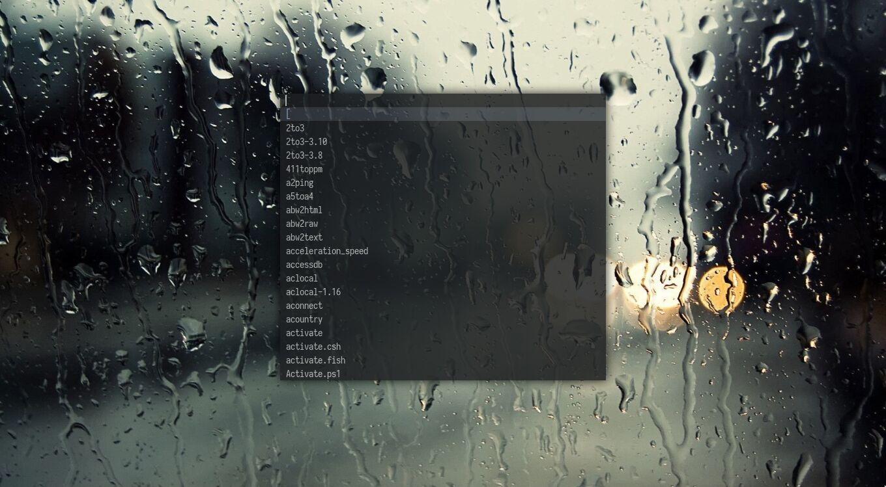

# dmenu

This repository is an specifc configuration for
[dmenu](https://tools.suckless.org/dmenu/).

Remote repository: [https://git.suckless.org/dmenu](https://git.suckless.org/dmenu)

## Preview

> The transparency and shadow is from the `picom` composer (not from the dmenu config)

## Applied patches

- [dmenu-border](https://tools.suckless.org/dmenu/patches/border/)

  Add borders to dmenu. (Although it's set to 0 currently)

- [dmenu-center](https://tools.suckless.org/dmenu/patches/center/)

  Center dmenu.
